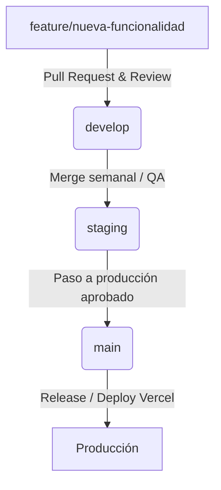

# Estrategia de Entornos, Git Flow y DevOps — La Gauchita Federal

> [!IMPORTANT]
> Este documento establece las directrices de ciclo de vida de software, control de versiones, variables de entorno y despliegues automáticos para el proyecto. 
> **No se deben configurar ambientes en vivo, ni inicializar repositorios o crear variables reales en esta tarea.**

---

## 1. Ambientes de la Plataforma

Para garantizar la estabilidad del portal, se definen cuatro ambientes aislados:

| Ambiente | Propósito | Infraestructura (Vercel) | Base de Datos / Auth (Supabase) | Origen de Datos (PostgreSQL) |
| :--- | :--- | :--- | :--- | :--- |
| **`local`** | Desarrollo local por ingenieros. | Servidor local (`npm run dev`) en puerto `localhost:3000`. | Proyecto de desarrollo local (Docker local / CLI Supabase) o base de datos `la-gauchita-federal-dev`. | Semillas estáticas locales y datos simulados. |
| **`development`** | Integración continua de features. | Despliegue automático de ramas `feature/*` y `develop` mediante Vercel Preview. | `la-gauchita-federal-dev` (instancia en la nube para pruebas del equipo). | Datos de prueba y contenidos prototipo. |
| **`staging`** | Validación editorial, institucional y QA. | Vercel Preview (enlazado a rama `develop`) con URL fija. | `la-gauchita-federal-staging` (espejo de producción). | Copia anonimizada de datos de producción para pruebas reales de rendimiento. |
| **`production`** | Portal público web y CMS en vivo. | Vercel Production (enlazado a rama `main`). URL oficial. | `la-gauchita-federal-prod` (alta disponibilidad, backups y RLS estricto). | Datos de producción reales con backups automáticos. |

---

## 2. Estrategia de Ramas (Git Branching Model)

Se adopta un modelo Git Flow simplificado para coordinar el desarrollo sin añadir sobrecarga:



### Reglas de las Ramas:
1. **`feature/*`**: Ramas de corta vida útil para desarrollar componentes, páginas o resolver incidentes específicos. Se ramifican de `develop` y se reintegran mediante Pull Requests.
2. **`develop`**: Rama principal de desarrollo técnico y de integración. Todos los desarrollos terminados se fusionan aquí. Corresponde al ambiente de **desarrollo**.
3. **`main`**: Rama estable de producción. Solo se fusionan cambios probados y aprobados en staging. Cada merge en esta rama gatilla un despliegue a **producción** en Vercel.

---

## 3. Variables de Entorno y Seguridad de Secretos

El sistema Next.js App Router requiere variables específicas para comunicarse con Supabase de manera segura:

```txt
# Variables Públicas (Accesibles en el navegador mediante el prefijo NEXT_PUBLIC_)
NEXT_PUBLIC_SUPABASE_URL=https://your-project-id.supabase.co
NEXT_PUBLIC_SUPABASE_ANON_KEY=eyJhbGciOiJIUzI1NiIsInR5cCI6IkpXVCJ9...
NEXT_PUBLIC_SITE_URL=https://lagauchitafederal.com.ar

# Secretos del Lado del Servidor (NUNCA deben usar el prefijo NEXT_PUBLIC_)
SUPABASE_SERVICE_ROLE_KEY=eyJhbGciOiJIUzI1NiIsInR5cCI6IkpXVCJ9.eyJpc3MiOiJzdXBhYmFzZSIsInJlZiI6...
```

### Reglas de Oro de Seguridad (Infranqueables):
* **No subir archivos `.env`**: Los archivos `.env`, `.env.local` o archivos reales de variables de desarrollo nunca se agregan al control de versiones Git (protegido mediante [.gitignore](file:///e:/DEV/PROYECTOS/LA_GAUCHITA_FEDERAL/base/02_codigo/app/.gitignore)).
* **Uso Exclusivo de `.env.example`**: El archivo [.env.example](file:///e:/DEV/PROYECTOS/LA_GAUCHITA_FEDERAL/base/02_codigo/app/.env.example) se mantendrá en el repositorio únicamente con campos vacíos o placeholders inofensivos.
* **Seguridad de la Service Role Key**: La clave `SUPABASE_SERVICE_ROLE_KEY` posee privilegios de administrador para hacer bypass de RLS. **Nunca** debe incluirse en código frontend ni usarse en archivos de la carpeta `src/components/` o páginas de renderizado de cliente (`"use client"`). Su uso se limita a Server Actions seguros o APIs en `/src/app/api/`.

---

## 4. Lineamientos de Operación para Agentes (Antigravity)

* **Prohibición de Generar Secretos**: El agente no creará archivos `.env` o archivos locales que simulen variables en producción. Se guiará estrictamente por [.env.example](file:///e:/DEV/PROYECTOS/LA_GAUCHITA_FEDERAL/base/02_codigo/app/.env.example).
* **Restricción de Conexiones Externas**: No se configurarán llamadas o conexiones de base de datos vivas sin autorización explícita del usuario en el chat.
* **No Imprimir Secretos**: Nunca se expondrán logs que impriman tokens de acceso de usuarios, llaves de API o cadenas de conexión de base de datos.
* **No Ejecutar Deploys**: El agente no ejecutará comandos de despliegue a Vercel (`vercel --prod`) ni alterará ramas remotas sin autorización.

---

## 5. Flujo Completo de Integración y Entrega (CI/CD)

1. **Desarrollo Local**: El desarrollador crea su rama `feature/mi-funcionalidad` localmente y ejecuta `npm run dev`.
2. **Push y Pull Request**: Se realiza push a GitHub de la rama `feature/` y se abre un Pull Request (PR) apuntando a `develop`.
3. **Despliegue Preview en Vercel**: Vercel detecta el PR y despliega una instancia de pruebas aislada vinculada a `la-gauchita-federal-dev`.
4. **Code Review & Linting**: Los linters y pruebas automáticas de GitHub Actions validan el código.
5. **Merge a Develop**: Se fusiona el PR. El ambiente de staging se actualiza.
6. **Pruebas de Staging**: Editores y personal técnico prueban la funcionalidad en staging contra `la-gauchita-federal-staging`.
7. **Paso a Producción**: Se genera un Pull Request de `develop` a `main`. Tras la aprobación, se hace merge y Vercel publica automáticamente el portal a producción enlazado a `la-gauchita-federal-prod`.
